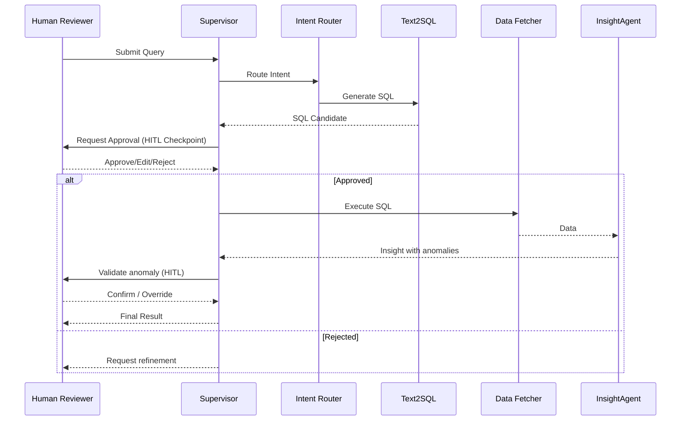

```mermaid
sequenceDiagram
    participant U as Human Reviewer
    participant S as Supervisor
    participant R as Intent Router
    participant T as Text2SQL
    participant D as Data Fetcher
    participant I as InsightAgent

    U->>S: Submit Query
    S->>R: Route Intent
    R->>T: Generate SQL
    T-->>S: SQL Candidate
    S->>U: Request Approval (HITL Checkpoint)
    U-->>S: Approve/Edit/Reject
    alt Approved
        S->>D: Execute SQL
        D-->>I: Data
        I-->>S: Insight with anomalies
        S->>U: Validate anomaly (HITL)
        U-->>S: Confirm / Override
        S-->>U: Final Result
    else Rejected
        S-->>U: Request refinement
    end
```
