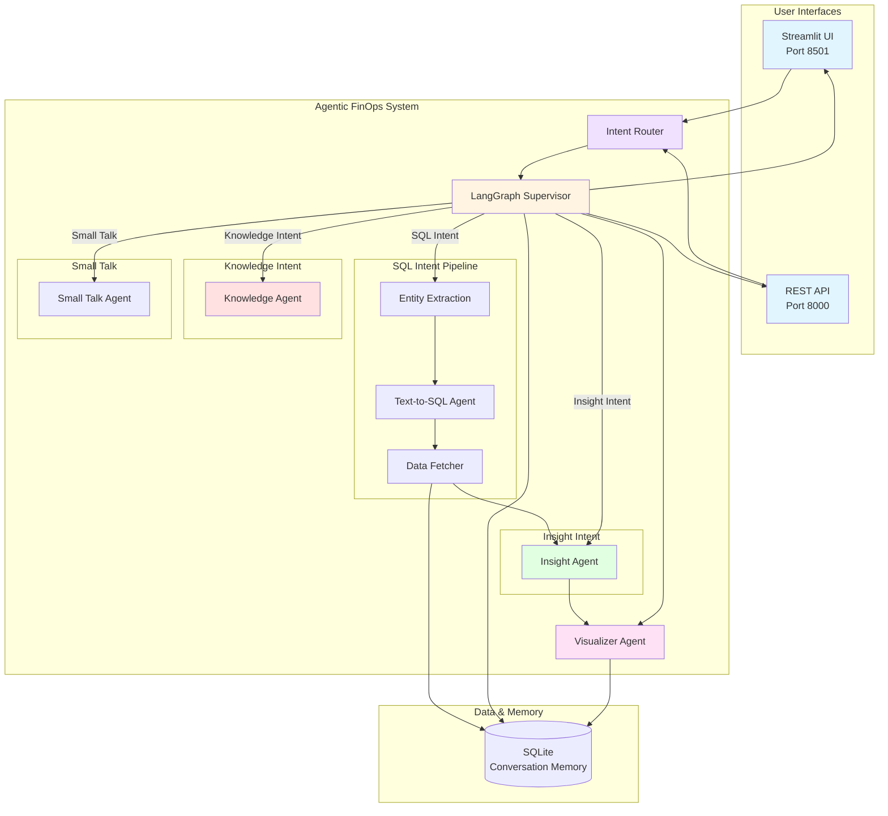
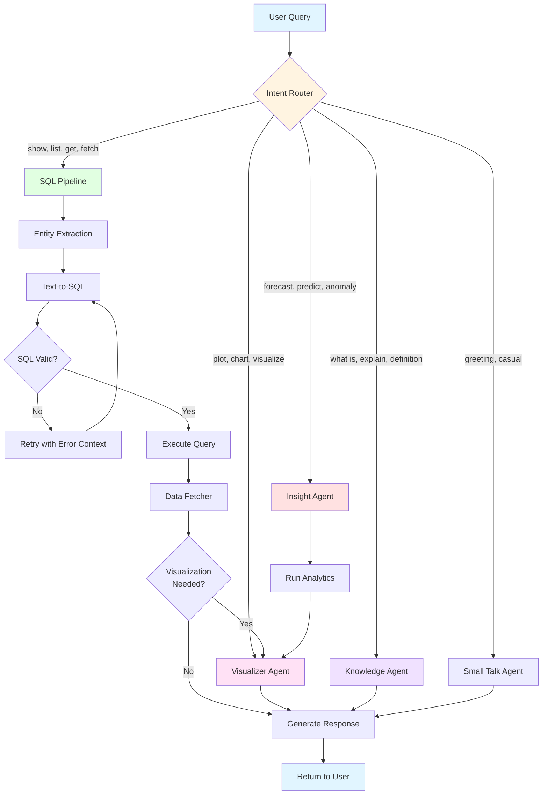
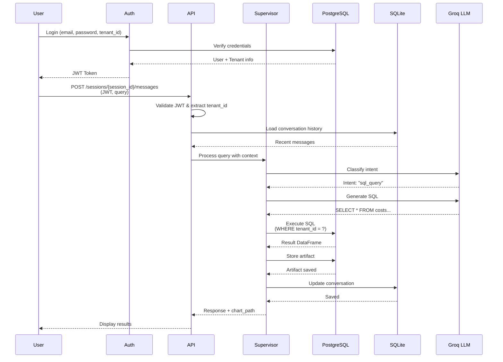
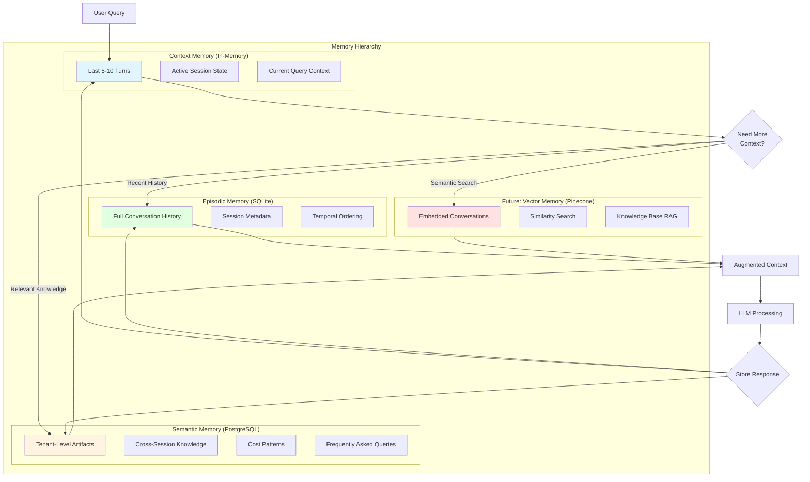
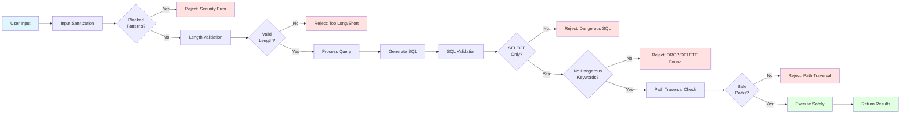
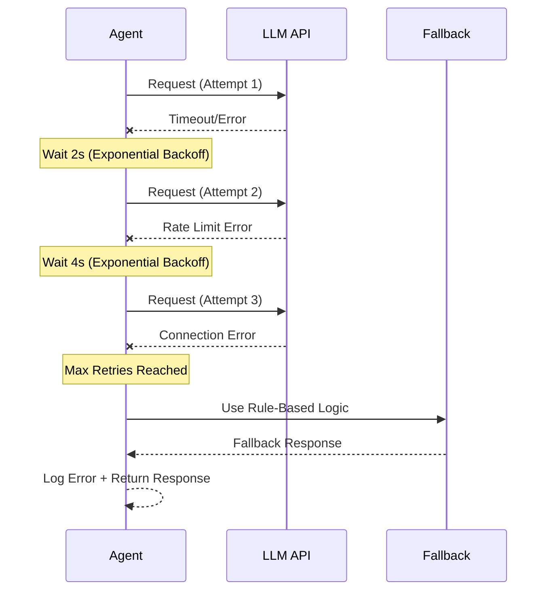
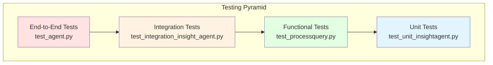

# Module 3: Production-Ready FinOps Agentic AI System

[](https://www.python.org/downloads/)
[](https://opensource.org/licenses/MIT)
[](https://readytensorproject-2-buqxvtwuwt5ldmpgardpcf.streamlit.app/)

## Executive Summary

Module 3 extends the ReadyTensor Project Module 2 by transforming a basic FinOps data analysis system into a production-ready, conversational AI agent with memory, advanced analytics, security guardrails, and dual interfaces (Streamlit UI + REST API).

### Key Enhancements from Module 2 to Module 3

| Feature | Module 2 | Module 3 |
|---------|----------|----------|
| **Architecture** | Single-turn queries | Multi-turn conversations with memory |
| **Analytics** | Basic aggregations | Forecasting, anomaly detection, correlations |
| **Visualizations** | Simple charts | 9 chart types with auto-detection |
| **Memory** | None | Session-based + SQLite persistence |
| **Security** | Basic | SQL injection prevention, input validation, path traversal protection |
| **Error Handling** | Minimal | Comprehensive try-catch, fallbacks, logging |
| **Interfaces** | Streamlit only | Streamlit UI + REST API |
| **Deployment** | Local only | Production-ready with monitoring |
| **Testing** | Manual | Unit + Integration + System tests |

---

## Table of Contents

- [Setup & Installation](#setup--installation)
- [System Architecture](#system-architecture)
- [System Overview](#system-overview)
- [Production Enhancements](#production-enhancements)
- [Testing Strategy](#testing-strategy)
- [User Interfaces](#user-interfaces)
- [Deployment](#deployment)
- [Project Structure](#project-structure)
- [Key Achievements](#key-achievements)

---

## Setup & Installation

### Prerequisites

- Python 3.10 or higher
- Git
- Docker (optional, for containerized deployment)
- AWS Account (for production deployment)

### Quick Start

```bash
# Clone the Repository
git clone https://github.com/Suchi-BITS/ReadyTensor_Project-2.git
cd ReadyTensor_Project-2

# Checkout the pr-3 Branch
git fetch origin
git checkout pr-3

# Create & Activate Virtual Environment
# Mac / Linux
python3 -m venv venv
source venv/bin/activate

# Windows (PowerShell)
python -m venv venv
.\venv\Scripts\activate

# Install Dependencies
pip install -r requirements.txt

# Create Your .env File
cp .env.example .env
# Edit .env and add your GROQ_API_KEY

# Run the Application
streamlit run integrations/app.py
```

### Running Tests

```bash
# Run all tests
pytest tests/

# Run specific test suites
pytest tests/test_agent.py
pytest tests/test_integration_insight_agent.py
pytest tests/test_processquery.py
pytest tests/test_unit_insightagent.py
```

### Deployed Application

🚀 **Live Demo**: [Streamlit App](https://readytensorproject-2-buqxvtwuwt5ldmpgardpcf.streamlit.app/)

---

## System Architecture

### High-Level System Architecture


```mermaid
graph TB
    subgraph "User Interfaces"
        UI[Streamlit UI<br/>Port 8501]
        API[REST API<br/>Port 8000]
    end
    
    subgraph "Agentic FinOps System"
        Router[Intent Router]
        Supervisor[LangGraph Supervisor]
        
        subgraph "SQL Intent Pipeline"
            Entity[Entity Extraction]
            Text2SQL[Text-to-SQL Agent]
            DataFetcher[Data Fetcher]
        end
        
        subgraph "Insight Intent"
            Insight[Insight Agent]
        end
        
        subgraph "Knowledge Intent"
            Knowledge[Knowledge Agent]
        end
        
        subgraph "Small Talk"
            SmallTalk[Small Talk Agent]
        end
        
        Visualizer[Visualizer Agent]
    end
    
    subgraph "Data & Memory"
        
        SQLite[(SQLite<br/>Conversation Memory)]
        
    end
    
    UI --> Router
    API --> Router
    Router --> Supervisor
    Supervisor -->|SQL Intent| Entity
    Entity --> Text2SQL
    Text2SQL --> DataFetcher
    DataFetcher --> Insight
    Supervisor -->|Insight Intent| Insight
    Supervisor -->|Knowledge Intent| Knowledge
    Supervisor -->|Small Talk| SmallTalk
    Insight --> Visualizer
    Supervisor --> Visualizer
    
    DataFetcher --> SQLite
    Supervisor --> SQLite
    Visualizer --> SQLite
    
    Supervisor --> UI
    Supervisor --> API
    
    style UI fill:#e1f5ff
    style API fill:#e1f5ff
    style Supervisor fill:#fff4e1
    style Router fill:#f0e1ff
    style Insight fill:#e1ffe1
    style Knowledge fill:#ffe1e1
    style Visualizer fill:#ffe1f5
```

### Agent Routing Decision Tree


```mermaid
graph TD
    Start[User Query] --> Router{Intent Router}
    
    Router -->|greeting, casual| SmallTalk[Small Talk Agent]
    Router -->|what is, explain, definition| Knowledge[Knowledge Agent]
    Router -->|show, list, get, fetch| SQL[SQL Pipeline]
    Router -->|plot, chart, visualize| Viz[Visualizer Agent]
    Router -->|forecast, predict, anomaly| Insight[Insight Agent]
    
    SQL --> Entity[Entity Extraction]
    Entity --> Text2SQL[Text-to-SQL]
    Text2SQL --> Validate{SQL Valid?}
    Validate -->|No| Retry[Retry with Error Context]
    Retry --> Text2SQL
    Validate -->|Yes| Execute[Execute Query]
    Execute --> DataFetch[Data Fetcher]
    
    DataFetch --> CheckViz{Visualization<br/>Needed?}
    CheckViz -->|Yes| Viz
    CheckViz -->|No| Response[Generate Response]
    
    Insight --> Analytics[Run Analytics]
    Analytics --> Viz
    
    Viz --> Response
    Knowledge --> Response
    SmallTalk --> Response
    
    Response --> User[Return to User]
    
    style Start fill:#e1f5ff
    style Router fill:#fff4e1
    style SQL fill:#e1ffe1
    style Insight fill:#ffe1e1
    style Knowledge fill:#f0e1ff
    style Viz fill:#ffe1f5
    style User fill:#e1f5ff
```

### Multi-Tenant Data Flow


```mermaid
sequenceDiagram
    participant User
    participant Auth
    participant API
    participant Supervisor
    participant DB as PostgreSQL
    participant Memory as SQLite
    participant LLM as Groq LLM
    
    User->>Auth: Login (email, password, tenant_id)
    Auth->>DB: Verify credentials
    DB-->>Auth: User + Tenant info
    Auth-->>User: JWT Token
    
    User->>API: POST /sessions/{session_id}/messages<br/>(JWT, query)
    API->>API: Validate JWT & extract tenant_id
    API->>Memory: Load conversation history
    Memory-->>API: Recent messages
    
    API->>Supervisor: Process query with context
    Supervisor->>LLM: Classify intent
    LLM-->>Supervisor: Intent: "sql_query"
    
    Supervisor->>LLM: Generate SQL
    LLM-->>Supervisor: SELECT * FROM costs...
    
    Supervisor->>DB: Execute SQL<br/>(WHERE tenant_id = ?)
    DB-->>Supervisor: Result DataFrame
    
    Supervisor->>DB: Store artifact
    DB-->>Supervisor: Artifact saved
    
    Supervisor->>Memory: Update conversation
    Memory-->>Supervisor: Saved
    
    Supervisor-->>API: Response + chart_path
    API-->>User: Display results
```

---

## System Overview

### Problem Statement

**Business Problem:**
Organizations struggle with cloud cost management due to:
- Lack of conversational interfaces for FinOps data
- No contextual memory across queries
- Limited predictive analytics capabilities
- Absence of production-ready security features
- Difficulty in accessing insights programmatically

**Solution:**
A production-grade conversational AI agent that:
- Remembers conversation context across multiple turns
- Provides advanced analytics (forecasting, anomaly detection)
- Offers dual interfaces (UI for humans, API for systems)
- Implements enterprise security and error handling
- Deploys reliably with monitoring and testing

### Data Flow

**Single Query Flow:**
```
1. User Input → 2. Validation → 3. Intent Classification → 
4. Memory Retrieval → 5. Agent Selection → 6. Processing → 
7. Memory Update → 8. Response Generation → 9. User Output
```

**Detailed Flow:**
```python
# Step 1: User submits query
query = "Show me cost trends for EC2"

# Step 2: Validation (validators.py)
validated_query = validate_query(query)
validated_csv = validate_csv_path(csv_path)

# Step 3: Memory retrieval (state.py)
conversation_history = get_session_history(session_id)
memory_context = format_memory_context(conversation_history)

# Step 4: State initialization
state = init_state(
    original_query=validated_query,
    conversation_history=conversation_history,
    memory_context=memory_context
)

# Step 5: Supervisor orchestration (supervisor.py)
result = run_supervisor(state, validated_csv)
# - classify_node: Determines intent
# - Route to appropriate agent
# - data_fetcher_node: Generates SQL, executes
# - visualize_node: Creates chart
# - knowledge_node: Adds context

# Step 6: Response delivery
return {
    "response": result["response"],
    "chart_path": result["chart_path"]
}
```

---

## Production Enhancements

### 1. Memory System

**Architecture:**
- **Short-term memory**: Last 5-10 conversation turns in RAM
- **Long-term memory**: Full history in SQLite
- **Entity memory**: Remembered filters, columns, services


```mermaid
graph TB
    subgraph "Memory Hierarchy"
        subgraph "Context Memory (In-Memory)"
            CTX1[Last 5-10 Turns]
            CTX2[Active Session State]
            CTX3[Current Query Context]
        end
        
        subgraph "Episodic Memory (SQLite)"
            EP1[Full Conversation History]
            EP2[Session Metadata]
            EP3[Temporal Ordering]
        end
        
        subgraph "Semantic Memory (PostgreSQL)"
            SM1[Tenant-Level Artifacts]
            SM2[Cross-Session Knowledge]
            SM3[Cost Patterns]
            SM4[Frequently Asked Queries]
        end
        
        subgraph "Future: Vector Memory (Pinecone)"
            VM1[Embedded Conversations]
            VM2[Similarity Search]
            VM3[Knowledge Base RAG]
        end
    end
    
    Query[User Query] --> CTX1
    CTX1 --> Retrieval{Need More<br/>Context?}
    Retrieval -->|Recent History| EP1
    Retrieval -->|Relevant Knowledge| SM1
    Retrieval -->|Semantic Search| VM1
    
    EP1 --> Augment[Augmented Context]
    SM1 --> Augment
    VM1 --> Augment
    Augment --> LLM[LLM Processing]
    
    LLM --> Store{Store Response}
    Store --> CTX1
    Store --> EP1
    Store --> SM1
    
    style CTX1 fill:#e1f5ff
    style EP1 fill:#e1ffe1
    style SM1 fill:#fff4e1
    style VM1 fill:#ffe1e1
```

**Implementation:**
```python
# schema/state.py
def init_state(
    original_query: str,
    conversation_history: List[Dict] = None
):
    memory_context = format_memory_context(conversation_history)
    remembered_entities = extract_entities_from_history(conversation_history)
    
    return {
        "original_query": original_query,
        "conversation_history": conversation_history,
        "memory_context": memory_context,
        "remembered_entities": remembered_entities,
        "turn_number": len(conversation_history) // 2 + 1
    }
```

**Benefits:**
- Context-aware responses
- Reference resolution ("show me that again")
- Follow-up questions work naturally
- Persistent across sessions

### 2. Advanced Analytics

**New Capabilities:**

1. **Cost Forecasting**
```python
# Linear regression forecasting
forecast_linear(df, date_col='date', value_col='cost', periods=3)
# Returns: [5000, 5200, 5400] (next 3 months)
```

2. **Anomaly Detection**
```python
# Z-score based anomaly detection
detect_anomalies_zscore(df, column='cost', z_thresh=3.0)
# Returns: {date: cost} for outliers

# Isolation Forest for complex patterns
detect_anomalies_isolation(df, column='cost', contamination=0.05)
```

3. **Statistical Analysis**
```python
# Moving averages for trend smoothing
moving_average(df, column='cost', window=7)

# Correlation analysis
correlation_matrix(df)
# Returns correlation between all numeric columns
```

### 3. Enhanced Visualizations

**9 Chart Types:**
1. Bar Chart (vertical/horizontal)
2. Line Chart (with area fill)
3. Pie Chart (with percentages)
4. Stacked Bar Chart (multi-category over time)
5. Scatter Plot
6. Area Chart
7. Heatmap
8. Grouped Bar Chart
9. Custom combinations

**Auto-Detection:**
```python
def determine_chart_type(query: str, detected_cols: Dict):
    if 'trend' in query and detected_cols['date']:
        return 'line'
    elif 'compare' in query and detected_cols['service']:
        return 'bar'
    elif 'distribution' in query:
        return 'pie'
    elif 'over time' in query and detected_cols['category']:
        return 'stacked_bar'
```

### 4. Security Features


```mermaid
graph LR
    Input[User Input] --> V1[Input Sanitization]
    V1 --> V2{Blocked<br/>Patterns?}
    V2 -->|Yes| Reject1[Reject: Security Error]
    V2 -->|No| V3[Length Validation]
    V3 --> V4{Valid<br/>Length?}
    V4 -->|No| Reject2[Reject: Too Long/Short]
    V4 -->|Yes| Process[Process Query]
    
    Process --> SQL[Generate SQL]
    SQL --> V5[SQL Validation]
    V5 --> V6{SELECT<br/>Only?}
    V6 -->|No| Reject3[Reject: Dangerous SQL]
    V6 -->|Yes| V7{No Dangerous<br/>Keywords?}
    V7 -->|No| Reject4[Reject: DROP/DELETE Found]
    V7 -->|Yes| V8[Path Traversal Check]
    V8 --> V9{Safe<br/>Paths?}
    V9 -->|No| Reject5[Reject: Path Traversal]
    V9 -->|Yes| Execute[Execute Safely]
    
    Execute --> Success[Return Results]
    
    style Input fill:#e1f5ff
    style Execute fill:#e1ffe1
    style Success fill:#e1ffe1
    style Reject1 fill:#ffe1e1
    style Reject2 fill:#ffe1e1
    style Reject3 fill:#ffe1e1
    style Reject4 fill:#ffe1e1
    style Reject5 fill:#ffe1e1
```

**Input Validation:**
```python
# utils/validators.py
BLOCKED_PATTERNS = [
    r'(?i)(drop|delete|truncate|alter)\s+(table|database)',
    r'(?i)(exec|execute|eval|system)',
    r'<script[^>]*>.*?</script>',
    r'\.\./|\.\.',  # Path traversal
    r'[;\|&`$]'     # Command injection
]

def validate_query(user_query: str):
    for pattern in BLOCKED_PATTERNS:
        if re.search(pattern, user_query):
            raise SecurityError("Potentially harmful content detected")
```

**SQL Injection Prevention:**
```python
def validate_sql_query(sql_query: str):
    # Only allow SELECT statements
    if not sql_query.upper().strip().startswith('SELECT'):
        raise SecurityError("Only SELECT queries allowed")
    
    # Block dangerous operations
    blocked = ['DROP', 'DELETE', 'UPDATE', 'INSERT', 'ALTER']
    for keyword in blocked:
        if keyword in sql_query.upper():
            raise SecurityError(f"Dangerous SQL operation: {keyword}")
```

### 5. Resilience & Fault Tolerance


```mermaid
sequenceDiagram
    participant Agent
    participant LLM as LLM API
    participant Fallback
    
    Agent->>LLM: Request (Attempt 1)
    LLM--xAgent: Timeout/Error
    
    Note over Agent: Wait 2s (Exponential Backoff)
    
    Agent->>LLM: Request (Attempt 2)
    LLM--xAgent: Rate Limit Error
    
    Note over Agent: Wait 4s (Exponential Backoff)
    
    Agent->>LLM: Request (Attempt 3)
    LLM--xAgent: Connection Error
    
    Note over Agent: Max Retries Reached
    
    Agent->>Fallback: Use Rule-Based Logic
    Fallback-->>Agent: Fallback Response
    Agent-->>Agent: Log Error + Return Response
```

**Retry Logic with Exponential Backoff:**
- Retries are capped to prevent infinite loops
- Backoff intervals increase exponentially on successive failures
- Final failures are surfaced with meaningful error messages

**Timeout Handling:**
- LLM inference calls
- Supervisor orchestration
- Agent execution steps

**Execution & Loop Limits:**
- Maximum agent turns per request
- Maximum number of graph nodes per execution

---

## Testing Strategy

### Test Coverage


```mermaid
graph TB
    subgraph "Testing Pyramid"
        E2E[End-to-End Tests<br/>test_agent.py]
        Integration[Integration Tests<br/>test_integration_insight_agent.py]
        Functional[Functional Tests<br/>test_processquery.py]
        Unit[Unit Tests<br/>test_unit_insightagent.py]
    end
    
    E2E --> Integration
    Integration --> Functional
    Functional --> Unit
    
    style E2E fill:#ffe1e1
    style Integration fill:#fff4e1
    style Functional fill:#e1ffe1
    style Unit fill:#e1f5ff
```

### 1. test_agent.py (End-to-end pipeline test)

**Objective:** Validate that the entire FinOps multi-agent pipeline executes correctly through:
Supervisor → Text2SQL → Insight → Visualization → Knowledge → Memory → Response.

**What it tests:**
- The Supervisor can run a query without crashing
- SQL is generated correctly by Text2SQL
- SQL executes and produces a DataFrame
- Insight agent returns meaningful analysis
- Visualization agent creates a chart when applicable
- MemoryNode updates memory after every query

### 2. test_integration_insight_agent.py (Integration Test)

**Objective:** Test how the Insight Agent behaves in combination with the DataFetcher and the SQL execution pipeline.

**What it tests:**
- A valid SQL query returns a DataFrame
- Insight agent runs analysis on the DataFrame
- Insight can detect anomalies using statistical patterns, cost spikes, and monthly comparisons

### 3. test_processquery.py (Functional Test)

**Objective:** Validate the process_query() pipeline logic.

**What it tests:**
- Correct intent classification for FinOps vs small-talk queries
- Entity extraction is called with correct arguments
- Returned structure contains entities, normalized query, and validated fields

### 4. test_unit_insightagent.py (Unit Test)

**Objective:** Test the internal logic of the Insight Agent in isolation.

**What it tests:**
- Can compute basic statistics (mean, sum, max)
- Handles empty DataFrames safely
- Detects anomalies based on outliers, unusual spikes, and sudden decreasing patterns

---

## User Interfaces

### Streamlit UI


**Features:**
- Chat-style interface
- Memory statistics display
- Inline chart rendering
- Clear chat/memory options
- Export conversation

**Code Structure:**
```python
# integrations/app.py
st.title("FinOps Agentic AI System")

# Sidebar
with st.sidebar:
    st.header("Data Configuration")
    csv_path = st.text_input("CSV File Path")
    if st.button("Load Data File"):
        st.session_state.csv_path = csv_path
    
    st.header("Memory Stats")
    st.metric("Total Messages", len(st.session_state.messages))
    st.metric("Conversation Turns", turn_count)

# Chat interface
for message in st.session_state.messages:
    with st.chat_message(message["role"]):
        st.markdown(message["content"])
        if message.get("chart_path"):
            st.image(message["chart_path"])

# Input
if prompt := st.chat_input("Ask about your cloud spending..."):
    result = process_query(
        prompt, 
        st.session_state.csv_path,
        st.session_state.conversation_history
    )
```

### REST API

**OpenAPI Documentation:** `http://localhost:8000/docs`

**Endpoints:**

```yaml
POST /session/create
  Response: {"session_id": "uuid", "message": "Session created"}

POST /session/{session_id}/upload-csv
  Body: FormData(file: CSV)
  Response: {"message": "File uploaded", "file_path": "..."}

POST /session/{session_id}/query
  Body: {"query": "Show costs"}
  Response: {
    "session_id": "uuid",
    "response": "Your costs are...",
    "chart_path": "path/to/chart.png",
    "turn_number": 3,
    "intent": "finops_query",
    "subagent": "data_fetcher"
  }

GET /session/{session_id}/history
  Response: {
    "session_id": "uuid",
    "history": [
      {"role": "user", "content": "...", "timestamp": "..."},
      {"role": "assistant", "content": "...", "timestamp": "..."}
    ],
    "total_messages": 10
  }

GET /sessions
  Response: [
    {
      "session_id": "uuid",
      "created_at": "...",
      "last_activity": "...",
      "message_count": 10,
      "has_csv": true
    }
  ]

DELETE /session/{session_id}
  Response: {"message": "Session deleted"}

GET /health
  Response: {
    "status": "healthy",
    "database": "connected",
    "active_sessions": 5
  }
```

**Usage Example:**
```python
import requests

BASE_URL = "http://localhost:8000"

# Create session
response = requests.post(f"{BASE_URL}/session/create")
session_id = response.json()["session_id"]

# Upload CSV
files = {"file": open("data.csv", "rb")}
requests.post(
    f"{BASE_URL}/session/{session_id}/upload-csv",
    files=files
)

# Query
response = requests.post(
    f"{BASE_URL}/session/{session_id}/query",
    json={"query": "Show total costs"}
)
result = response.json()
print(result["response"])

# Get history
history = requests.get(
    f"{BASE_URL}/session/{session_id}/history"
).json()
```

---

## Deployment

### Local Development

```bash
# Setup
git clone https://github.com/Suchi-BITS/ReadyTensor_Project-2.git
cd ReadyTensor_Project-2
git checkout pr-3
python -m venv venv
source venv/bin/activate  # Windows: venv\Scripts\activate
pip install -r requirements.txt

# Configure
cp .env.example .env
# Edit .env and add GROQ_API_KEY

# Run Streamlit UI
streamlit run integrations/app.py

# Run API
uvicorn api:app --reload --port 8000
```

### Docker Deployment

```dockerfile
# Dockerfile
FROM python:3.10-slim-buster

# Set working directory
WORKDIR /app

# Copy application code
COPY . /app

# Install system dependencies
RUN apt-get update -y && \
    apt-get install -y \
        awscli \
        ffmpeg \
        libsm6 \
        libxext6 \
        unzip && \
    apt-get clean && \
    rm -rf /var/lib/apt/lists/*

# Install Python dependencies
RUN pip install --no-cache-dir -r requirements.txt

# Run application
CMD ["python3", "app.py"]


```


#### Docker Setup in EC2

Execute the following commands on your EC2 instance:

**Optional Updates:**
```bash
sudo apt-get update -y
sudo apt-get upgrade
```

**Required Docker Installation:**
```bash
# Download Docker installation script
curl -fsSL https://get.docker.com -o get-docker.sh

# Install Docker
sudo sh get-docker.sh

# Add ubuntu user to docker group
sudo usermod -aG docker ubuntu

# Activate the changes to groups
newgrp docker
```

#### Configure EC2 as Self-Hosted Runner

Follow GitHub's documentation to add your EC2 instance as a self-hosted runner for your repository.

#### Setup GitHub Secrets

Navigate to your repository settings and add the following secrets:

| Secret Name | Description | Example Value |
|-------------|-------------|---------------|
| `AWS_ACCESS_KEY_ID` | AWS Access Key ID | Your AWS access key |
| `AWS_SECRET_ACCESS_KEY` | AWS Secret Access Key | Your AWS secret key |
| `AWS_REGION` | AWS Region | `us-east-1` |
| `AWS_ECR_LOGIN_URI` | AWS ECR Login URI | `566373416292.dkr.ecr.ap-south-1.amazonaws.com` |
| `ECR_REPOSITORY_NAME` | ECR Repository Name | `finops-agent-app` |

**How to Add GitHub Secrets:**
1. Go to your repository on GitHub
2. Click on **Settings**
3. Select **Secrets and variables** → **Actions**
4. Click **New repository secret**
5. Add each secret with its corresponding value

**Notes:**
- Ensure your IAM user has permissions for ECR (Elastic Container Registry) operations
- The EC2 instance should have appropriate security group rules to allow necessary traffic
- Keep your AWS credentials secure and never commit them to your repository

---

## Project Structure

```
finops-agent-module3/
├── README.md
├── requirements.txt
├── .env.example
├── Dockerfile
├── docker-compose.yml
├── api.py                      # FastAPI REST API
├── finops_memory.db           # SQLite database (auto-created)
│
├── integrations/
│   ├── __init__.py
│   ├── main.py               # Core processing logic with validation
│   └── app.py                # Streamlit UI with memory
│
├── agents/
│   ├── __init__.py
│   ├── supervisor.py         # LangGraph orchestrator
│   ├── intent_router.py      # Intent classification
│   ├── data_fetcher.py       # SQL generation & execution
│   ├── insightAgent.py       # Advanced analytics
│   ├── visualizerAgent.py    # Chart generation
│   ├── knowledge.py          # RAG knowledge base
│   ├── small_talk.py         # Casual conversation
│   └── agentic_tools/
│       └── entity_extraction.py
│
├── schema/
│   ├── __init__.py
│   └── state.py              # State management with memory
│
├── utils/
│   ├── __init__.py
│   ├── validators.py         # Security & validation
│   ├── logger_setup.py       # Logging configuration
│   └── prompt_loader.py      # Prompt management
│
├── data/
│   ├── sample_data.csv       # Sample FinOps data
│   └── finops_knowledge.txt  # Domain knowledge
│
├── uploads/                   # User-uploaded CSVs
├── results/                   # Generated charts
│
├── tests/
│   ├── unit/
│   │   ├── test_validators.py
│   │   ├── test_state.py
│   │   └── test_agents.py

# Conclusion
This FinOps AI Agent already delivers a powerful multi-agent reasoning pipeline, memory persistence, advanced analytics, and seamless Text2SQL automation, but there is a clear roadmap for taking it to the next level.

The upcoming milestones focus on building a full memory stack that includes a richer context layer, a detailed episodic memory for past conversations and user-specific behaviors, and a robust semantic memory powered by embeddings and similarity search to store reusable knowledge.
Integrating a hybrid memory architecture (context + episodic + semantic) will enable the system to maintain long-term awareness, improve personalization, and produce more consistent multi-turn insights.
Additional enhancements include introducing graph-based memory (GraphRAG), refining retrieval quality, strengthening guardrails and observability, and expanding the REST API for enterprise-scale deployment. With these upgrades, the platform evolves into a fully autonomous, self-improving FinOps assistant capable of long-term learning and continuous optimisation across cloud financial operations.

# License
MIT License - Free for research and prototyping
Copyright (c) 2025 Suchismita Sahu
Permission is hereby granted, free of charge, to any person obtaining a copy
of this software and associated documentation files (the "Software"), to deal
in the Software without restriction, including without limitation the rights
to use, copy, modify, merge, publish, distribute, sublicense, and/or sell
copies of the Software.
# References
- LangGraph Documentation: Multi-Agent Orchestration Patterns
- "Text-to-SQL in the Wild: A Naturally-Occurring Dataset Based on Stack Exchange Data" (Finegan-Dollak et al., 2018)
- "RAT-SQL: Relation-Aware Schema Encoding and Linking for Text-to-SQL Parsers" (Wang et al., 2020)
- "BIRD-SQL: A Large-Scale Cross-Domain Text-to-SQL Benchmark" (Li et al., 2023)
- PostgreSQL Multi-Tenant Architecture Best Practices
