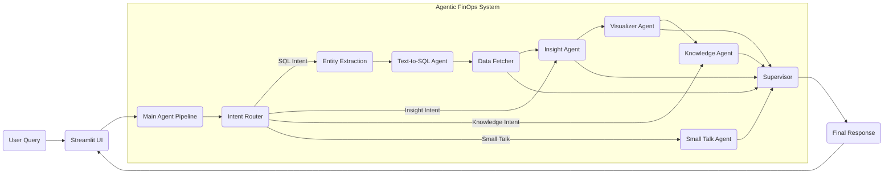
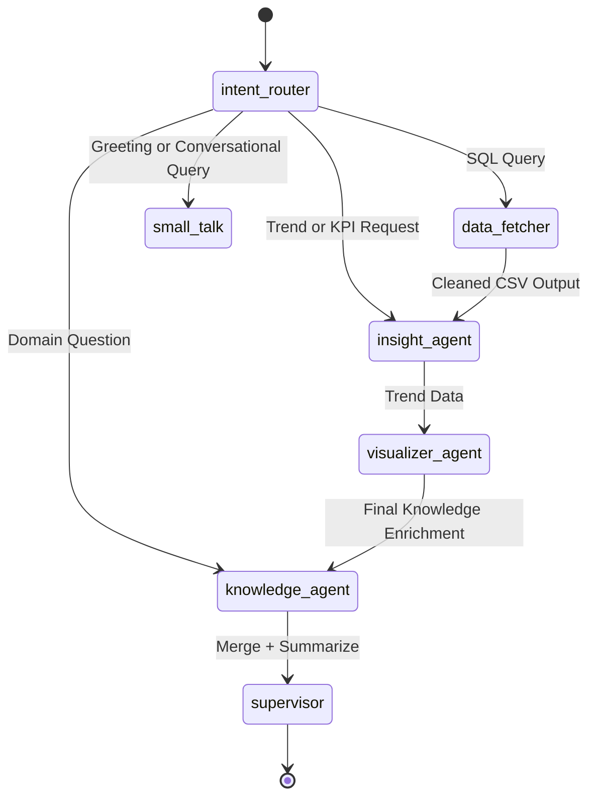
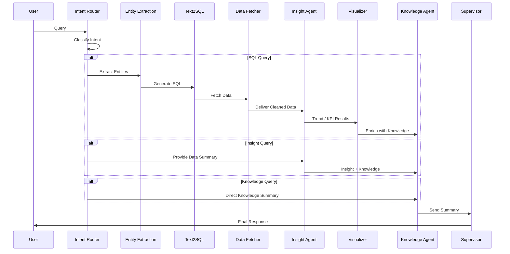
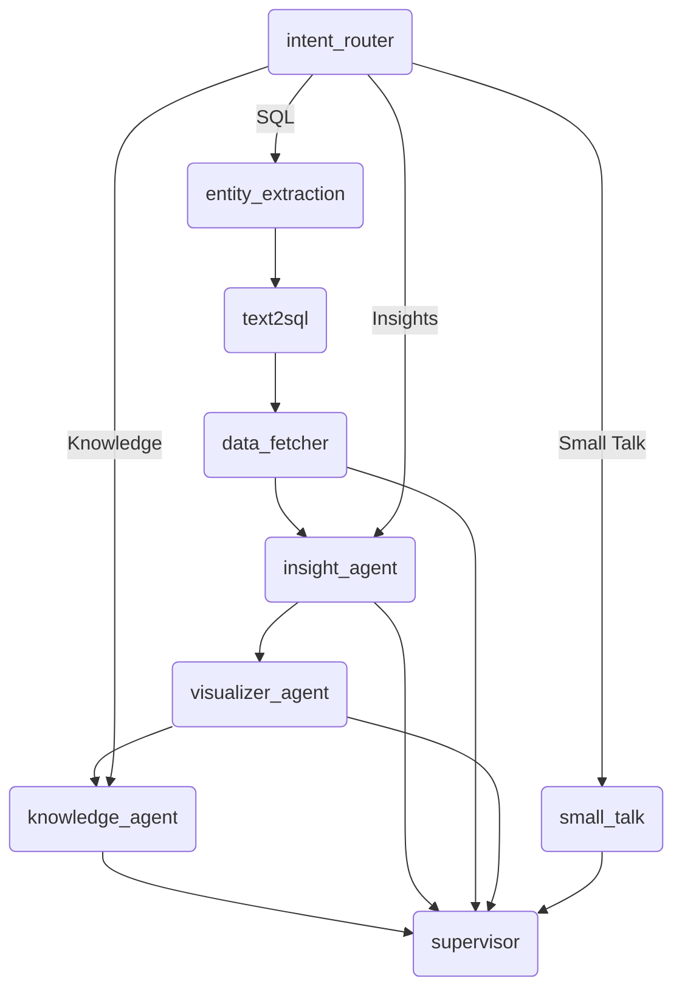

# FinOps Conversational Agentic AI System

This repository contains a production-grade FinOps Agentic AI system built using:
- LangChain  
- LangGraph  
- Groq LLMs  
- Python REPL Tool  
- RAG over FinOps domain documents  
- Streamlit Frontend  

***Instruction: User has to upload the shared datafile present sample_data.csv in the streamlit UI an ask FinOps related queries. This file is also present in the data/folder in this git repo.

The system handles FinOps queries end-to-end:  
natural language → intent routing → SQL → insights → visualization → RAG → final summary.

---

# 1. Features

- Multi-agent pipeline using LangGraph  
- Natural-language intent routing  
- Zero-hallucination entity extraction  
- Text-to-SQL generation for Snowflake  
- Data fetching and cleaning  
- Trend and anomaly insight generation  
- Automated cost visualizations  
- Domain-grounded RAG summarization  
- Modular prompts  
- Streamlit UI integration  

---

# 2. Project Structure

```
A-Agent/
│
├── agents/
│   ├── agentic_tools/
│   │   ├── entity_extraction.py
│   │   ├── text2sql.py
│   │   ├── transfer_tools.py
│   │   └── __init__.py
│   │
│   ├── data_fetcher.py
│   ├── insightAgent.py
│   ├── intent_router.py
│   ├── knowledge.py
│   ├── small_talk.py
│   ├── supervisor.py
│   └── visualizerAgent.py
│
├── prompts/
│   ├── intent_router.txt
│   ├── knowledge_agent.txt
│   ├── schema-context.txt
│   ├── supervisor.txt
│   ├── text2sql.txt
│   ├── visualizer.txt
│   └── small_talk.txt
│
├── data/
│   ├── cloud_architecture_patterns.txt
│   ├── cloud_cost_analysis.txt
│   ├── cloud_cost_anomaly_detection.txt
│   ├── cloud_cost_governance.txt
│   ├── cloud_cost_optimisation_strategy.txt
│   ├── cloud_financial_forecasting.txt
│   ├── cloud_financial_operating_maturity_model.txt
│   ├── cloud_predictive_analysis.txt
│   ├── finops_operating_model.txt
│   └── finops.txt
│
├── results/
│   ├── data_cleaned.csv
│   ├── query_results.csv
│   ├── auto_visualization.png
│   ├── trend_chart.png
│   └── trend_chart_modern.png
│
├── utils/
│   ├── prompt_loader.py
│   ├── logger_setup.py
│   ├── log_utils.py
│   └── sample.py
│
├── integrations/
│   ├── app.py
│   └── main.py
│
├── .env
├── requirements.txt
├── secrets.toml
└── README.md
```

---

# 3. Overall Architecture

## 3.1 High-Level System Architecture



---

# 4. Multi-Agent Workflow (LangGraph Execution)



---

# 5. Internal RAG Architecture

```mermaid
flowchart TB
    subgraph DataFolder[/data Folder/]
        A1(cloud_cost_analysis.txt)
        A2(finops_operating_model.txt)
        A3(cloud_predictive_analysis.txt)
        A4(cloud_cost_governance.txt)
        A5(cloud_architecture_patterns.txt)
    end

    A1 --> L(load_all_finops_docs)
    A2 --> L
    A3 --> L
    A4 --> L
    A5 --> L

    L --> RAGProcessor(Concatenate + Normalize)
    RAGProcessor --> KG(Knowledge Agent)
    KG --> SUP(Supervisor)
    SUP --> FinalOutput
```

---

# 6. Agent-to-Agent Communication (Sequence Diagram)

This shows how agents hand over tasks dynamically based on intent, data availability, and workflow rules.



---

# 7. LangGraph Node Visualization (Actual Graph Structure)



---

# 8. Environment Variables (.env)

```
GROQ_API_KEY="your_key"
SNOWFLAKE_USER="username"
SNOWFLAKE_PASSWORD="password"
SNOWFLAKE_ACCOUNT="account"
SNOWFLAKE_WAREHOUSE="warehouse"
SNOWFLAKE_DATABASE="database"
SNOWFLAKE_SCHEMA="schema"
MODEL_NAME="llama-3.3-70b-versatile"
```

---

# 9. Installation

```
git clone https://github.com/Suchi-BITS/ReadyTensor_Project-2.git
python -m venv venv
venv\Scripts\activate
pip install --upgrade pip
pip install -r requirements.txt
```

---

# 10. Running the Application

Streamlit UI:

```
streamlit run integrations/app.py
```

CLI pipeline:

```
python -m integrations.main
```

Run supervisor only:

```
python -m agents.supervisor
```

---

# 11. How RAG Works

1. All `.txt` files inside `/data` are loaded.  
2. Combined into a single FinOps domain corpus.  
3. Passed into the Knowledge Agent.  
4. Groq LLM generates a grounded summary.  
5. Supervisor merges SQL + Insights + RAG into final response.

---

# 12. Outputs

The system generates:

- Cleaned SQL outputs  
- Trend insights  
- Charts (PNG)  
- FinOps summaries  
- Full combined final answers  

Artifacts appear inside: `results/`

---

# 13. Testing

```
python -m tests.test_agent
```


